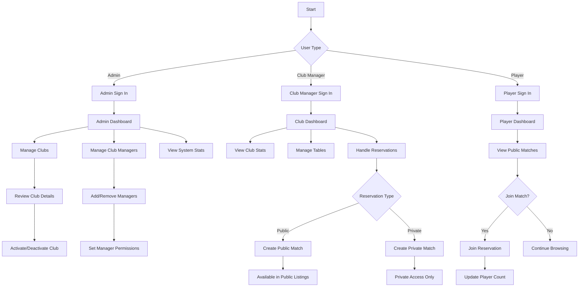

```mermaid
graph TD
    %% Authentication Flow
    A[Start] --> B{User Type}
    B -->|Admin| C[Admin Sign In]
    B -->|Club Manager| D[Club Manager Sign In]
    B -->|Player| E[Player Sign In]

    %% Admin Flow
    C --> F[Admin Dashboard]
    F --> G[Manage Clubs]
    F --> H[Manage Club Managers]
    F --> I[View System Stats]

    %% Club Manager Flow
    D --> J[Club Dashboard]
    J --> K[View Club Stats]
    J --> L[Manage Tables]
    J --> M[Handle Reservations]

    %% Player Flow
    E --> N[Player Dashboard]
    N --> O[View Public Matches]
    O --> P{Join Match?}
    P -->|Yes| Q[Join Reservation]
    P -->|No| R[Continue Browsing]
    Q --> S[Update Player Count]

    %% Reservation States
    M --> T{Reservation Type}
    T -->|Public| U[Create Public Match]
    T -->|Private| V[Create Private Match]
    U --> W[Available in Public Listings]
    V --> X[Private Access Only]

    %% Club Management
    G --> Y[Review Club Details]
    Y --> Z[Activate/Deactivate Club]
    H --> AA[Add/Remove Managers]
    AA --> AB[Set Manager Permissions]
```
