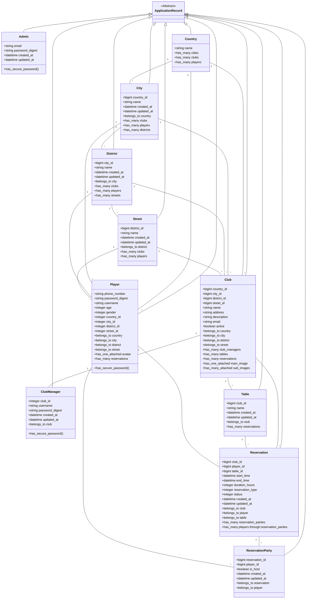

```mermaid
classDiagram
    class ApplicationRecord {
        <<Abstract>>
    }

    class Admin {
        +string email
        +string password_digest
        +datetime created_at
        +datetime updated_at
        +has_secure_password()
    }

    class Country {
        +string name
        +has_many cities
        +has_many clubs
        +has_many players
    }

    class City {
        +bigint country_id
        +string name
        +datetime created_at
        +datetime updated_at
        +belongs_to country
        +has_many clubs
        +has_many players
        +has_many districts
    }

    class District {
        +bigint city_id
        +string name
        +datetime created_at
        +datetime updated_at
        +belongs_to city
        +has_many clubs
        +has_many players
        +has_many streets
    }

    class Street {
        +bigint district_id
        +string name
        +datetime created_at
        +datetime updated_at
        +belongs_to district
        +has_many clubs
        +has_many players
    }

    class Club {
        +bigint country_id
        +bigint city_id
        +bigint district_id
        +bigint street_id
        +string name
        +string address
        +string description
        +string email
        +boolean active
        +belongs_to country
        +belongs_to city
        +belongs_to district
        +belongs_to street
        +has_many club_managers
        +has_many tables
        +has_many reservations
        +has_one_attached main_image
        +has_many_attached sub_images
    }

    class ClubManager {
        +integer club_id
        +string username
        +string password_digest
        +datetime created_at
        +datetime updated_at
        +belongs_to club
        +has_secure_password()
    }

    class Table {
        +bigint club_id
        +string name
        +datetime created_at
        +datetime updated_at
        +belongs_to club
        +has_many reservations
    }

    class Player {
        +string phone_number
        +string password_digest
        +string username
        +integer age
        +integer gender
        +integer country_id
        +integer city_id
        +integer district_id
        +integer street_id
        +belongs_to country
        +belongs_to city
        +belongs_to district
        +belongs_to street
        +has_secure_password()
        +has_one_attached avatar
        +has_many reservations
    }

    class Reservation {
        +bigint club_id
        +bigint player_id
        +bigint table_id
        +datetime start_time
        +datetime end_time
        +integer duration_hours
        +integer reservation_type
        +integer status
        +datetime created_at
        +datetime updated_at
        +belongs_to club
        +belongs_to player
        +belongs_to table
        +has_many reservation_parties
        +has_many players through:reservation_parties
    }

    class ReservationParty {
        +bigint reservation_id
        +bigint player_id
        +boolean is_host
        +datetime created_at
        +datetime updated_at
        +belongs_to reservation
        +belongs_to player
    }

    ApplicationRecord <|-- Admin
    ApplicationRecord <|-- Country
    ApplicationRecord <|-- City
    ApplicationRecord <|-- District
    ApplicationRecord <|-- Street
    ApplicationRecord <|-- Club
    ApplicationRecord <|-- ClubManager
    ApplicationRecord <|-- Table
    ApplicationRecord <|-- Player
    ApplicationRecord <|-- Reservation
    ApplicationRecord <|-- ReservationParty

    Country "1" -- "*" City
    Country "1" -- "*" Club
    Country "1" -- "*" Player
    City "1" -- "*" District
    City "1" -- "*" Club
    City "1" -- "*" Player
    District "1" -- "*" Street
    District "1" -- "*" Club
    District "1" -- "*" Player
    Street "1" -- "*" Club
    Street "1" -- "*" Player
    Club "1" -- "*" ClubManager
    Club "1" -- "*" Table
    Club "1" -- "*" Reservation
    Table "1" -- "*" Reservation
    Player "1" -- "*" Reservation
    Reservation "1" -- "*" ReservationParty
    Player "1" -- "*" ReservationParty
```
