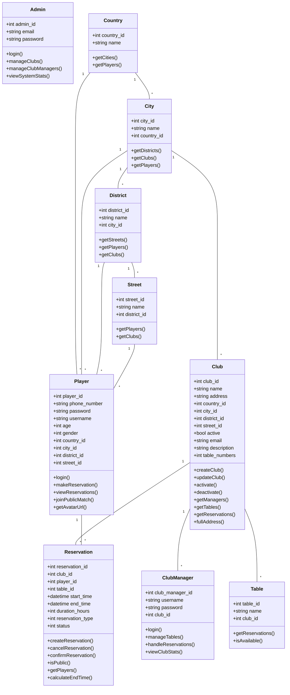

```mermaid


classDiagram
    class Admin {
        +int admin_id
        +string email
        +string password
        +login()
        +manageClubs()
        +manageClubManagers()
        +viewSystemStats()
    }

    class Country {
        +int country_id
        +string name
        +getCities()
        +getPlayers()
    }

    class City {
        +int city_id
        +string name
        +int country_id
        +getDistricts()
        +getClubs()
        +getPlayers()
    }

    class District {
        +int district_id
        +string name
        +int city_id
        +getStreets()
        +getPlayers()
        +getClubs()
    }

    class Street {
        +int street_id
        +string name
        +int district_id
        +getPlayers()
        +getClubs()
    }

    class Club {
        +int club_id
        +string name
        +string address
        +int country_id
        +int city_id
        +int district_id
        +int street_id
        +bool active
        +string email
        +string description
        +int table_numbers
        +createClub()
        +updateClub()
        +activate()
        +deactivate()
        +getManagers()
        +getTables()
        +getReservations()
        +fullAddress()
    }

    class ClubManager {
        +int club_manager_id
        +string username
        +string password
        +int club_id
        +login()
        +manageTables()
        +handleReservations()
        +viewClubStats()
    }

    class Table {
        +int table_id
        +string name
        +int club_id
        +getReservations()
        +isAvailable()
    }

    class Player {
        +int player_id
        +string phone_number
        +string password
        +string username
        +int age
        +int gender
        +int country_id
        +int city_id
        +int district_id
        +int street_id
        +login()
        +makeReservation()
        +viewReservations()
        +joinPublicMatch()
        +getAvatarUrl()
    }

    class Reservation {
        +int reservation_id
        +int club_id
        +int player_id
        +int table_id
        +datetime start_time
        +datetime end_time
        +int duration_hours
        +int reservation_type
        +int status
        +createReservation()
        +cancelReservation()
        +confirmReservation()
        +isPublic()
        +getPlayers()
        +calculateEndTime()
    }

    Country "1" -- "*" City
    City "1" -- "*" District
    District "1" -- "*" Street
    City "1" -- "*" Club
    Club "1" -- "*" ClubManager
    Club "1" -- "*" Table
    Club "1" -- "*" Reservation
    Player "1" -- "*" Reservation
    Country "1" -- "*" Player
    City "1" -- "*" Player
    District "1" -- "*" Player
    Street "1" -- "*" Player


```
